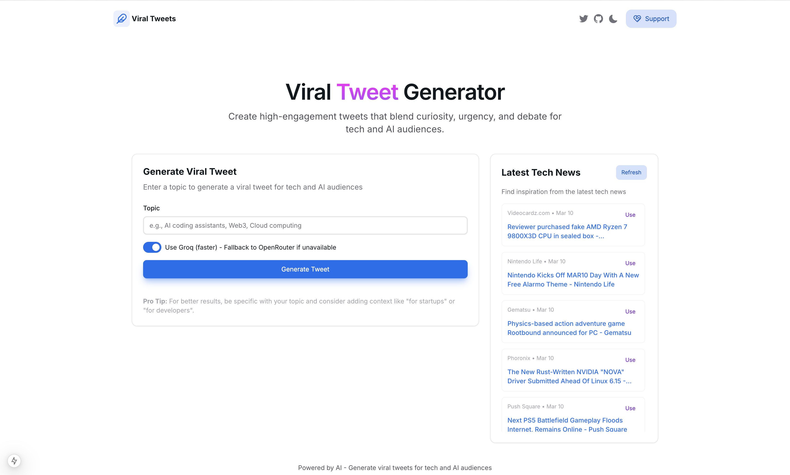

# Viral Tweet Generator

A modern web application that generates viral tweets for tech and AI audiences using AI. Built with Next.js and HeroUI.



## Features

- 🚀 Generate viral tweets for tech and AI audiences
- 🤖 Powered by Groq's LLaMA 3 70B model with OpenRouter fallback
- 📰 Integration with NewsAPI for latest tech news inspiration
- 🎨 Beautiful UI built with HeroUI components
- 🌙 Dark mode support

## Getting Started

### Prerequisites

- Node.js 18+ and npm/yarn
- API keys for:
  - [Groq](https://console.groq.com/)
  - [OpenRouter](https://openrouter.ai/)
  - [NewsAPI](https://newsapi.org/)

### Installation

1. Clone the repository:

```bash
git clone https://github.com/sahaib/Viral-Tweet-Generator.git
cd Viral-Tweet-Generator
```

2. Install dependencies:

```bash
npm install
# or
yarn install
```

3. Set up environment variables:

```bash
cp .env.local.example .env.local
```

Then edit `.env.local` and add your API keys.

4. Run the development server:

```bash
npm run dev
# or
yarn dev
```

5. Open [http://localhost:3000](http://localhost:3000) in your browser.

## Deployment

### Deploying to Vercel

This project is optimized for deployment on Vercel:

1. Push your code to the GitHub repository
2. Import the project in Vercel (https://vercel.com/new)
3. Add the required environment variables in the Vercel dashboard:
   - `GROQ_API_KEY`
   - `OPENROUTER_API_KEY`
   - `NEWS_API_KEY`
   - `NEXT_PUBLIC_APP_URL` (set to your Vercel deployment URL)
4. Deploy!

## Environment Variables

The following environment variables are required:

- `GROQ_API_KEY`: Your Groq API key
- `OPENROUTER_API_KEY`: Your OpenRouter API key
- `NEWS_API_KEY`: Your NewsAPI key
- `NEXT_PUBLIC_APP_URL`: Your app URL (used for OpenRouter HTTP-Referer header)

## How It Works

The Viral Tweet Generator uses AI to create engaging tweets following this framework:

- **Hook**: Starts with a shocking stat, analogy, or question
- **Bold Angle**: Adds a contrarian take, prediction, or comparison
- **Engagement Trigger**: Ends with a debate question, poll, or FOMO tease

The app uses Groq's LLaMA 3 70B model for fast generation, with a fallback to OpenRouter's meta-llama/llama-3.3-70b-instruct model if Groq is unavailable.

## Tech Stack

- [Next.js](https://nextjs.org/) - React framework
- [HeroUI](https://heroui.com/) - UI component library
- [Groq](https://groq.com/) - Primary AI model provider
- [OpenRouter](https://openrouter.ai/) - Fallback AI model provider
- [NewsAPI](https://newsapi.org/) - Tech news API
- [Lucide React](https://lucide.dev/) - Icon library

## Security Considerations

- API keys are stored as environment variables and never exposed to the client
- All API requests are made server-side in API routes
- Input validation is performed on all user inputs
- CORS headers are properly configured

## License

This project is licensed under the MIT License - see the LICENSE file for details.
